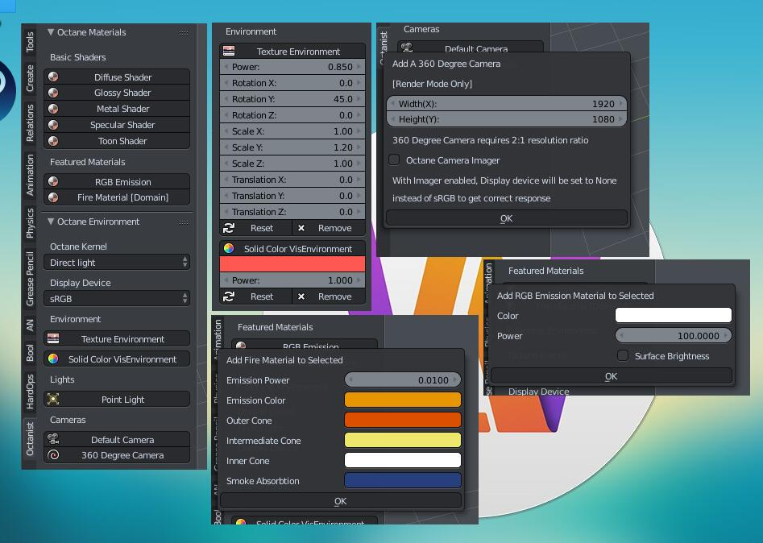

# blender-octanerender-helper-addon_octanist
This addon wrote in Python called Octanist, which is a helper addon for the Octane render Blender plugin

#### 1.0.0 - octanist_v1.py was first realeased on [Facebook group](https://www.facebook.com/groups/500738480259364) on March 9, 2018
#### 2.0.0 - octanist_v2.py was first realeased on [Facebook group](https://www.facebook.com/groups/500738480259364) on March 27, 2018

## Octane Blender Plugin Version
#### OctaneRender™ for Blender 3.08 - 15.0

## Blender Version
#### 2.79 a

## System Environment
#### Windows, Mac OS X, Linux

## Features

